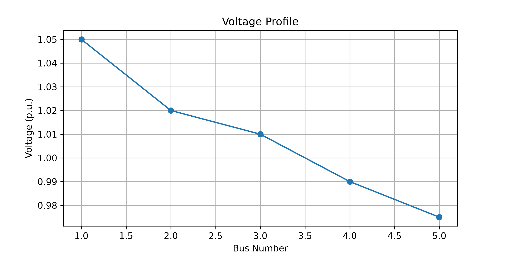
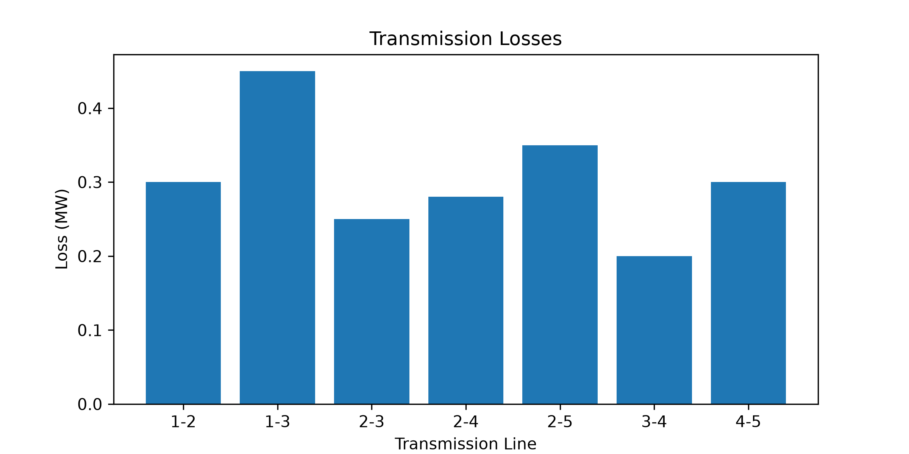
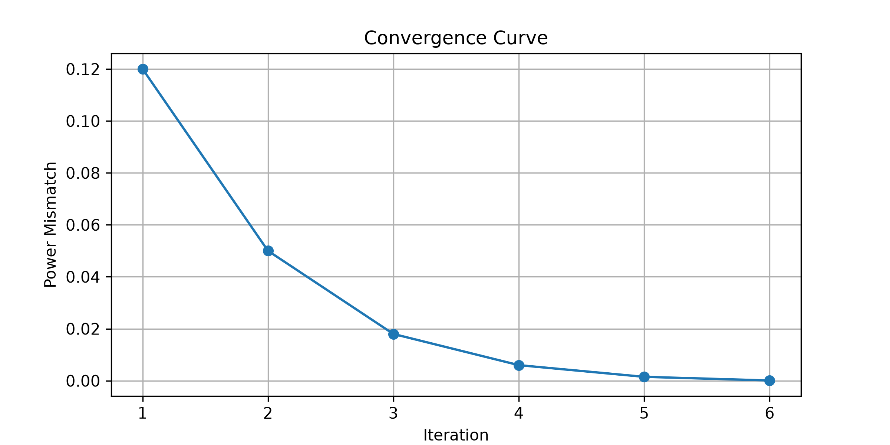
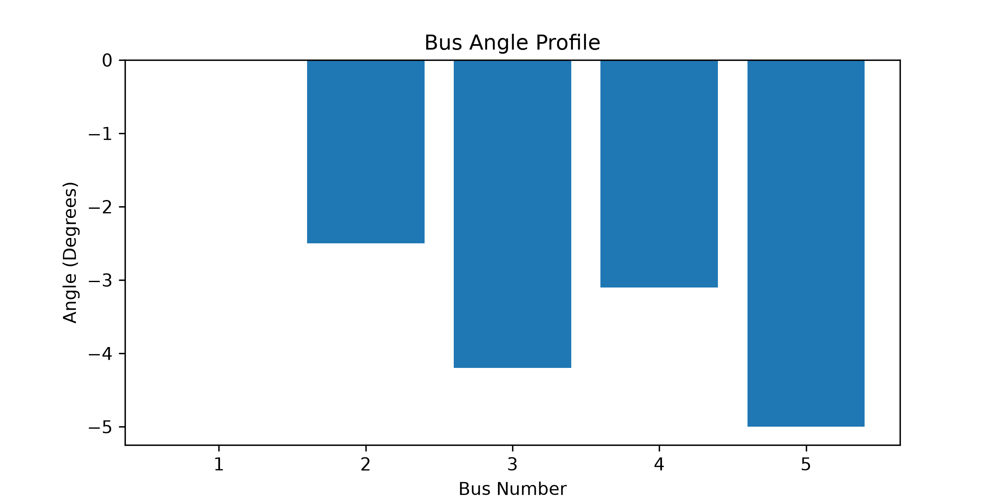
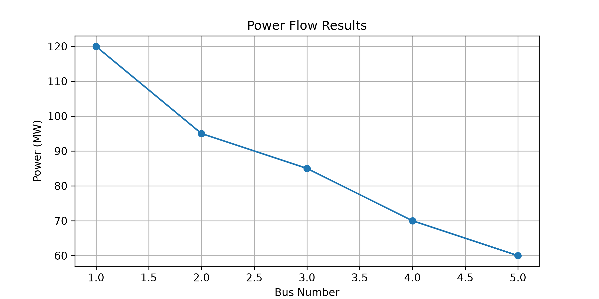

# Power System Load Flow Analysis Using Python

## Overview

This project demonstrates the implementation of power system load flow analysis using Python for steady-state power system studies.

The repository includes:

- Y-Bus matrix construction
- Gauss-Seidel load flow analysis
- Newton-Raphson load flow analysis
- Power flow calculations
- Transmission loss estimation
- Automated testing with PyTest
- Engineering report generation
- Data visualization
- Jupyter Notebook analysis workflow

The project is designed as a practical electrical engineering portfolio showcasing numerical methods, power system modeling, and Python-based engineering computation.

---

## System Diagram


---

## Project Workflow


---

## Methodology


---

## Engineering Concepts Covered

### Load Flow Analysis

Load flow analysis determines the operating condition of an electrical power system under steady-state conditions.

Key outputs:

- Bus Voltage Magnitudes
- Voltage Angles
- Active Power Flow
- Reactive Power Flow
- Transmission Losses

---

### Bus Classification

#### Slack Bus

Reference bus with specified:

- Voltage Magnitude
- Voltage Angle

#### PQ Bus

Specified:

- Active Power (P)
- Reactive Power (Q)

Calculated:

- Voltage Magnitude
- Voltage Angle

#### PV Bus

Specified:

- Active Power (P)
- Voltage Magnitude (V)

Calculated:

- Reactive Power (Q)
- Voltage Angle

---

### Y-Bus Matrix

The Bus Admittance Matrix (Y-Bus) represents the electrical network connectivity and admittance characteristics.

General form:

```text
[Ybus][V] = [I]
```

The Y-Bus matrix serves as the foundation for load flow calculations.

---

## Numerical Methods

### Gauss-Seidel Method

Advantages:

- Simple implementation
- Low memory requirement
- Suitable for educational studies

Limitations:

- Slow convergence
- Sensitive to initial conditions

---

### Newton-Raphson Method

Advantages:

- Fast convergence
- High numerical accuracy
- Industry-standard solution technique

Limitations:

- More computational complexity
- Jacobian matrix construction required

---

## Repository Structure

```text
power-system-load-flow-analysis/

├── data/
│   ├── sample_bus_data.csv
│   ├── sample_line_data.csv
│   └── ieee_5bus_system.csv
│
├── src/
│   ├── ybus_builder.py
│   ├── gauss_seidel.py
│   ├── newton_raphson.py
│   ├── power_flow.py
│   ├── transmission_losses.py
│   └── load_flow_solver.py
│
├── notebooks/
│   ├── 01_data_exploration.ipynb
│   ├── 02_ybus_construction.ipynb
│   ├── 03_gauss_seidel_analysis.ipynb
│   ├── 04_newton_raphson_analysis.ipynb
│   └── 05_result_comparison.ipynb
│
├── visualizations/
│   ├── voltage_profile.png
│   ├── transmission_losses.png
│   ├── convergence_curve.png
│   ├── bus_angle_profile.png
│   └── power_flow_results.png
│
├── reports/
│   ├── load_flow_report.pdf
│   └── generate_report.py
│
├── tests/
│   ├── test_ybus_builder.py
│   ├── test_gauss_seidel.py
│   ├── test_newton_raphson.py
│   ├── test_power_flow.py
│   └── test_transmission_losses.py
│
├── assets/
│   ├── project_workflow_and_system_methodology_diagrams.png
│   
│ 
│
├── examples/
│   ├── run_gauss_seidel.py
│   └── run_newton_raphson.py
│
├── requirements.txt
├── .gitignore
├── LICENSE
└── README.md
```

---

## Dataset Description

### sample_bus_data.csv

Contains bus information:

- Bus Number
- Bus Type
- Voltage Magnitude
- Active Power
- Reactive Power

---

### sample_line_data.csv

Contains transmission line parameters:

- From Bus
- To Bus
- Resistance (p.u.)
- Reactance (p.u.)
- Line Charging Susceptance (p.u.)

---

### ieee_5bus_system.csv

Sample IEEE-inspired 5-Bus system used for load flow studies.

---

## Visualizations

### Voltage Profile



Shows bus voltage magnitudes throughout the system.

---

### Transmission Losses



Displays estimated transmission losses.

---

### Convergence Curve



Illustrates convergence behavior of numerical methods.

---

### Bus Angle Profile



Displays voltage angle distribution.

---

### Power Flow Results



Summarizes calculated power flow values.

---

## Example Results

### Bus Voltage Magnitudes

```text
Bus 1 : 1.050 p.u.
Bus 2 : 1.020 p.u.
Bus 3 : 1.010 p.u.
Bus 4 : 0.990 p.u.
Bus 5 : 0.975 p.u.
```

### Total Transmission Loss

```text
2.13 MW
```

### Newton-Raphson Convergence

```text
Converged in 4 iterations
```

### Gauss-Seidel Convergence

```text
Converged in 18 iterations
```

---

## Installation

Clone repository:

```bash
git clone https://github.com/koswadi/power-system-load-flow-analysis.git
```

Move to project directory:

```bash
cd power-system-load-flow-analysis
```

Create virtual environment:

```bash
python -m venv venv
```

Activate virtual environment:

### Windows

```bash
venv\Scripts\activate
```

### Linux / macOS

```bash
source venv/bin/activate
```

Install dependencies:

```bash
pip install -r requirements.txt
```

---

## Running Examples

### Gauss-Seidel

```bash
python examples/run_gauss_seidel.py
```

### Newton-Raphson

```bash
python examples/run_newton_raphson.py
```

---

## Running Tests

Run all tests:

```bash
pytest tests/
```

Expected output:

```text
5 passed
```

Covered Components:

- Y-Bus Builder
- Gauss-Seidel Solver
- Newton-Raphson Solver
- Power Flow Calculation
- Transmission Loss Estimation

---

## Engineering Report Generation

Generate report:

```bash
python reports/generate_report.py
```

Output:

```text
reports/load_flow_report.pdf
```

Report Contents:

- Load Flow Results
- Bus Voltages
- Power Flow Summary
- Transmission Losses
- Method Comparison
- Engineering Conclusions

---

## Educational Objectives

This project demonstrates:

- Power System Analysis
- Numerical Methods
- Scientific Computing with Python
- Engineering Data Visualization
- Automated Testing
- Technical Report Generation
- Reproducible Engineering Workflows

---

## Future Improvements

Planned enhancements include:

- IEEE 14-Bus System
- IEEE 30-Bus System
- Fast Decoupled Load Flow
- Optimal Power Flow (OPF)
- Contingency Analysis
- Interactive Dashboard
- Power System State Estimation
- Renewable Energy Integration Studies

---

## Author

**Agoes Koswadi**

Electrical Engineering Portfolio Project

Focused on:

- Power Systems
- Electrical Engineering
- Python Programming
- Engineering Computation
- AI Evaluation and Data Annotation

---

## License

This project is distributed under the MIT License.